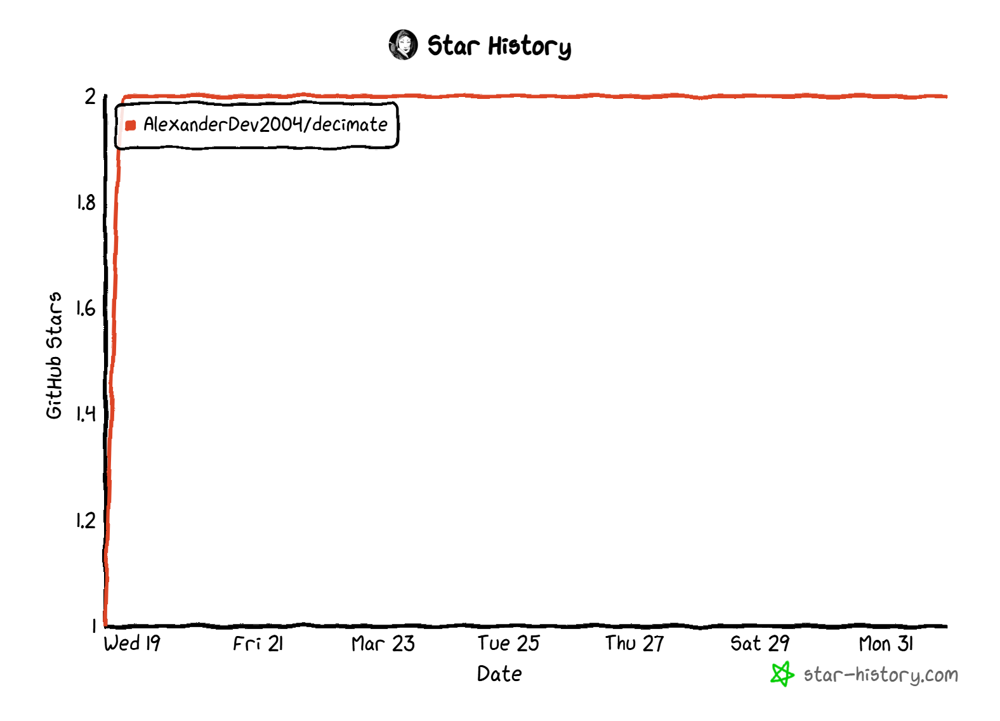

## About Project 
Decimate is a web application that allows users to create and manage their own data decimation plans. It provides a user-friendly interface for creating and editing decimation plans, as well as a visual representation of the decimation process. The application also includes a feature for monitoring the progress of decimation jobs and generating reports on the decimation process.

## Features
- User-friendly interface for creating and editing decimation plans
- Visual representation of the decimation process
- Monitoring of decimation jobs
- Generation of reports on the decimation process

## requidment Using Project  
fastapi
jinja2
livereload
polars
uvicorn

## Star History

<!--  -->